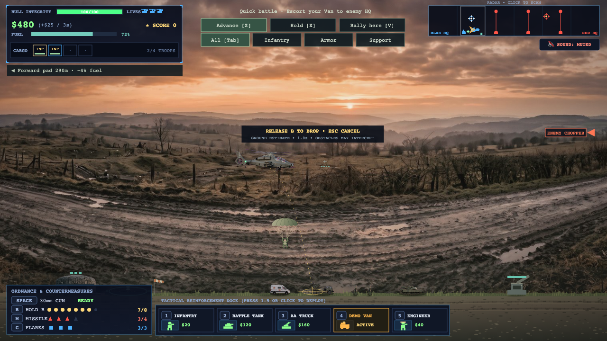
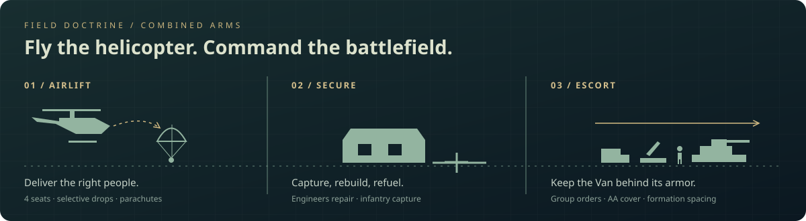
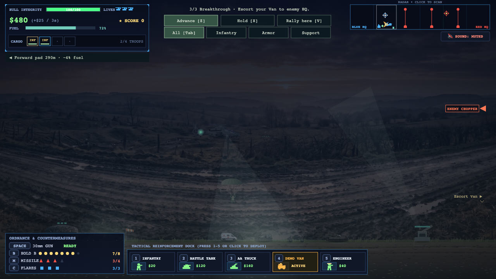
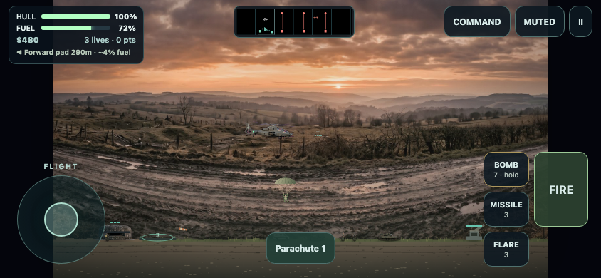

<div align="center">

# RESCUE RAIDERS

**Fly the helicopter. Command the battlefield. Bring your people home.**

A browser tribute to *Rescue Raiders* and *Armor Alley*, with combined-arms tactics, airborne rescues, and a living battlefield.

[](https://dbbaskette.github.io/RescueRaiders/)
[](https://github.com/dbbaskette/RescueRaiders/actions/workflows/checks.yml)
[](https://github.com/dbbaskette/RescueRaiders/commits/main/)
[](https://opensource.org/license/mit)

**[Play now](https://dbbaskette.github.io/RescueRaiders/)** · **[Field manual](docs/FIELD_MANUAL.md)** · **[Report an issue](https://github.com/dbbaskette/RescueRaiders/issues)**

</div>



## One helicopter. An entire front.

Escort your Demo Van to enemy HQ while protecting your own base. Airlift infantry to capture bunkers, insert engineers to rebuild turrets, and keep armor and anti-aircraft support moving together. Your helicopter can turn a battle—but it needs fuel, ammunition, and somewhere safe to land.



| Fly & recover | Command & adapt | Feel the battlefield |
| --- | --- | --- |
| Automatic boarding and four individual cargo seats | Infantry, armor and support orders | Day and night operations |
| Wind-aware bomb predictor | Tanks lead; AA and infantry cover the Van | Rain, wet ground and gusts |
| Forward-pad fuel guidance | Engineers capture and repair defenses | Terrain wash, smoke, wrecks and positional audio |
| Pilot bailout and recovery bonuses | Three campaign missions with saved checkpoints | Smooth action replays with slow motion |

## Night changes the view

Landing lights, turret searchlights, muzzle flashes and illuminated pads pick out the battlefield. Rain reduces visibility; wind moves the aircraft, parachutes, smoke and bombs. The final campaign mission takes place at night. Quick Battle also lets you choose daylight or night and clear, gusty or rainy conditions.



*Realism is expressed through readable 2D physics and visual approximations. This is an arcade tactics game, not a flight simulator.*

## A flight deck for your phone

Open the same game on a phone or tablet in **landscape**. Steer with one thumb and operate weapons with the other. The **Command** panel pauses the battle for purchases, group orders and passenger selection. Rotation or leaving the page pauses safely.



No installation or account required. Use [`?touch=1`](https://dbbaskette.github.io/RescueRaiders/?touch=1) to preview the touch interface on desktop.

## Choose your sortie

| Mode | Your objective |
| --- | --- |
| **Quick Battle** | Capture territory and escort your Van through a full battlefield. |
| **Campaign · 1 / Foothold** | Secure the marked forward bunker. |
| **Campaign · 2 / Bring them home** | Recover four stranded troops and deliver them to HQ. |
| **Campaign · 3 / Breakthrough** | Escort your Van past occupied defenses at night. |
| **Training** | Learn flight, bombing, boarding and bunker capture without enemy deployments. |
| **Flight Academy** | Practice selective cargo drops, parachutes, engineer capture/repair and armor orders. |

**Resume campaign** returns to the beginning of your saved mission. Difficulty, sound, shake and environment preferences are stored locally in your browser. No account or cloud save is involved; unavailable browser storage falls back to the current tab.

<details>
<summary><strong>Desktop controls</strong></summary>

| Input | Action |
| --- | --- |
| **WASD / arrows** | Fly |
| **Space** | Fire gun |
| **Hold B → release** | Preview → drop one bomb; **Esc** cancels |
| **M / C** | Missile / flares |
| **E** | Board low; deploy the bay low or one parachutist aloft |
| **Q / F** | Select passenger / deploy selected passenger |
| **1–5** | Buy infantry, tank, AA truck, Demo Van, engineer |
| **Tab** | Select All, Infantry, Armor or Support |
| **Z / X / V** | Advance / Hold / Rally selected group at helicopter |
| **J** | Bail out when damaged, high enough, and a spare helicopter remains |
| **P** | Pause; adjust shake or convoy escort behavior |
| **Click radar** | Scan a sector; steering restores tracking |
| **C / T / Y / U** on menu | New campaign / training / academy / resume campaign |
| **R** on debrief | Replay; **Space** changes speed, **F** changes camera, **Esc** exits |

Landing in front of friendly troops and holding still boards them automatically. **Support** includes AA trucks and the Van; engineers follow the **Infantry** group. See the [field manual](docs/FIELD_MANUAL.md) for costs, service limits and tactical details.

</details>

<details>
<summary><strong>Run locally & contribute</strong></summary>

The game runs directly from static files: Canvas for graphics, Web Audio for synthesized sound. There are no runtime packages or build steps.

```sh
python3 -m http.server 8085
```

Open **http://localhost:8085/**. To run gameplay and mobile regressions with Node.js 22 or later:

```sh
node --test tests/*.cjs
```

| File | Responsibility |
| --- | --- |
| `index.html` | Simulation, rendering, audio and desktop interface |
| `experience.js` | Missions, cargo, commands, camera and replay |
| `operations.js` | Saves, weather/night, escorts, navigation, academy and pilot recovery |
| `mobile.js` / `mobile.css` | Touch controls and responsive flight deck |
| `tests/` | Dependency-free gameplay and mobile regression checks |

CI runs these tests on Node.js 22 and 24. The status and last-commit badges above update with the repository. The images are captures from the game; the [field manual](docs/FIELD_MANUAL.md) documents its rules.

</details>

## Credits & license

An independent tribute inspired by *Rescue Raiders* and *Armor Alley*. Not affiliated with their original creators. Code is released under the [MIT License](https://opensource.org/license/mit).
